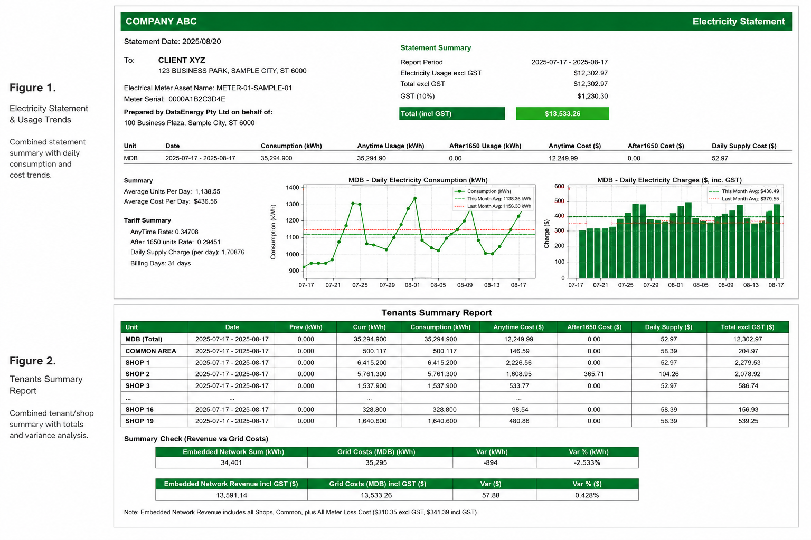
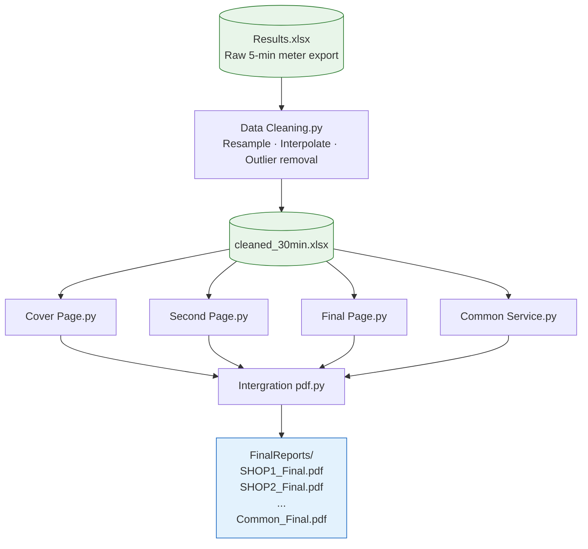

# Tenant Electricity Billing

Automated electricity statement generator for retail tenants — processes raw smart meter exports into professional per-shop PDF reports.



---

## Pipeline



---

## Features

- Cleans and resamples 5-min smart meter readings → 30-min intervals
- Linear interpolation for missing data; outlier removal
- Peak / off-peak / anytime tariff calculation per shop
- GST and daily charge breakdown
- Per-tenant PDF cover page with consumption summary and cost table
- Daily usage bar chart with MDB loss overlay
- Tenant summary report across all shops
- Common service & MDB meter handling
- Batch generation — one run produces all shop PDFs

---

## Project Structure

```
├── Data Cleaning.py              # Step 1 — clean & resample raw meter data
├── Coding/
│   ├── Cover Page.py             # Step 2 — cover page with billing summary
│   ├── Second Page.py            # Step 3 — daily usage & cost charts
│   ├── Final Page.py             # Step 4 — tenants summary table
│   ├── Common Service.py         # Step 5 — common area / MDB meter page
│   └── Intergration pdf.py       # Step 6 — merge all pages → final PDFs
├── Archived codes/               # Earlier iterations kept for reference
└── screenshot/                   # README assets
```

---

## Requirements

```bash
pip install pandas numpy reportlab matplotlib PyPDF2 openpyxl
```

---

## Usage

Place the following input files in the project root:

| File | Description |
|------|-------------|
| `Results.xlsx` | Raw meter export — columns: `DateTime`, `kWh_IMP`, `kWh_EXP`, `Meter` |
| `C&E Report (Tariff after July).xlsx` | Tariff mapping per shop + last-month billing reference |

Then run each step in order:

```bash
python "Data Cleaning.py"
python "Coding/Cover Page.py"
python "Coding/Second Page.py"
python "Coding/Final Page.py"
python "Coding/Common Service.py"
python "Coding/Intergration pdf.py"
```

Output PDFs are saved to `FinalReports/`.

---

## Notes

- Data files (`.xlsx`, `.pdf`) are excluded from this repo via `.gitignore` — add your own input files locally
- Meter IDs follow the pattern `SHOP1`–`SHOP19`, `MDB`, and `Common Service`
